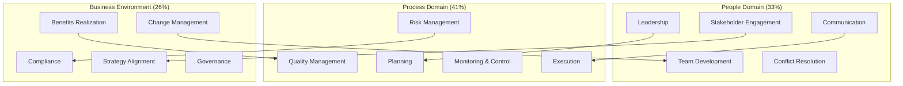
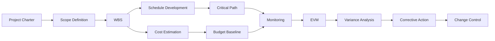

# Design Document

## Overview

This design document outlines the architecture and implementation approach for enhancing the PMP Exam Study Guide repository. The enhancements focus on improving content organization, adding comprehensive study aids, and creating better navigation and cross-referencing throughout the Markdown-based documentation.

The design follows a content-first approach, recognizing that this is a documentation repository with no code implementation. All enhancements will be achieved through:
- Additional Markdown documents for study aids
- Improved cross-referencing using Markdown links
- Better content organization and structure
- Comprehensive indexes and reference materials
- Visual aids using Mermaid diagrams

## Architecture

### Repository Structure

The enhanced repository will maintain the existing chapter-based structure while adding new supporting documents:

```
PMP-2026/
├── Chapter 0-24/          # Existing chapter content
├── Chapter 98/            # Appendices (enhanced)
│   ├── Appendix A – Key Formulas and Definitions.md (enhanced)
│   ├── Appendix B – Sources.md
│   └── Appendix C – Tools and Artifacts Index.md (enhanced)
├── Chapter 99/            # Resources
├── Study-Aids/            # NEW: Study support materials
│   ├── Study-Plans/
│   │   ├── Fast-Track-4-6-Weeks.md
│   │   ├── Standard-8-12-Weeks.md
│   │   └── Comprehensive-16-Plus-Weeks.md
│   ├── Flashcards-By-Domain.md
│   ├── Quick-Reference-Guide.md
│   ├── Concept-Map.md
│   ├── Scenario-Index.md
│   └── Progress-Tracking-Template.md
├── Practice-Exams/        # NEW: Additional practice materials
│   ├── Practice-Exam-3.md
│   ├── Practice-Exam-3-Answers.md
│   ├── Practice-Exam-4.md
│   ├── Practice-Exam-4-Answers.md
│   └── Exam-Scoring-Template.md
├── Quality/               # NEW: Content quality assurance
│   ├── Content-Quality-Checklist.md
│   ├── Terminology-Master-List.md
│   └── Link-Validation-Guide.md
└── README.md              # Enhanced with study path guidance
```

### Content Organization Principles

1. **Separation of Concerns**: Core chapter content remains focused on teaching concepts; study aids are separated into dedicated directories
2. **Progressive Disclosure**: Readers can access basic content first, then dive into study aids as needed
3. **Consistent Formatting**: All new documents follow established Markdown conventions from AGENTS.md
4. **Bidirectional Linking**: Cross-references work in both directions (chapter → appendix, appendix → chapter)

## Components and Interfaces

### Component 1: Cross-Reference System

**Purpose**: Enable readers to navigate between related concepts across chapters

**Implementation**:
- Markdown links using relative paths
- "Related Topics" sections at the end of each major section
- Consistent link formatting: `[Chapter X: Topic Name](../Chapter X/filename.md#section)`
- Glossary term links: `[Term](../Chapter 98/Appendix A – Key Formulas and Definitions.md#term)`

**Example Structure**:
```markdown
## 5.1 Stakeholders and Stakeholder Engagement

[Content here...]

### Related Topics
- [Chapter 7: Stakeholder and Communication Mastery](../Chapter 7/7 – Stakeholder and Communication Mastery.md)
- [Chapter 15: Strategy and Portfolio Alignment](../Chapter 15/15 – Strategy and Portfolio Alignment.md)
- [Stakeholder Analysis Tools](../Chapter 98/Appendix C – Tools and Artifacts Index.md#stakeholder-analysis)
```

### Component 2: Study Path Documents

**Purpose**: Provide structured learning paths for different preparation timelines

**Implementation**:
- Three separate Markdown files for different timelines
- Weekly breakdown with specific chapter assignments
- Time estimates for each chapter
- Checkpoint milestones
- Domain-specific focus recommendations

**Document Structure**:
```markdown
# Fast-Track Study Plan (4-6 Weeks)

## Overview
This accelerated plan focuses on high-priority content...

## Week 1: Foundations and Exam Strategy
- **Monday-Tuesday**: Chapter 1-2 (4 hours)
- **Wednesday-Thursday**: Chapter 3-4 (5 hours)
- **Friday-Sunday**: Chapter 5 core sections (6 hours)
- **Checkpoint**: Complete Chapter 5 knowledge check

## Week 2: People Domain (33% of exam)
[...]
```

### Component 3: Enhanced Knowledge Checks

**Purpose**: Improve existing knowledge checks with domain mapping and detailed explanations

**Implementation**:
- Add domain tags to each question
- Include ECO task references
- Enhance explanations with chapter cross-references
- Add performance summary tables

**Enhanced Question Format**:
```markdown
## Question 1: Stakeholder Engagement Strategy

**Domain**: People (33%)
**ECO Task**: Engage and support virtual teams

A project manager is leading a distributed team across three time zones...

[Question content...]

**Answer: B) Schedule overlapping hours for synchronous collaboration**

**Explanation**:
This question tests your understanding of virtual team management (People domain).

Option B is correct because:
- It addresses the core challenge of time zone differences
- It aligns with PMI's emphasis on team collaboration
- It balances asynchronous and synchronous work

See also:
- [Chapter 6: Building and Leading Teams](../Chapter 6/6 – Building and Leading Teams.md#remote-teams)
- [Chapter 7: Communication Planning](../Chapter 7/7c – Communication Planning and Strategy.md)

**Performance Summary**:
| Domain | Questions | Your Score |
|--------|-----------|------------|
| People | 5 | - |
| Process | 4 | - |
| Business Environment | 3 | - |
```

### Component 4: Formula Reference Enhancement

**Purpose**: Expand Appendix A with comprehensive formula documentation

**Implementation**:
- Standardized formula entry format
- Multiple worked examples per formula
- Visual aids for complex calculations
- Cross-references to chapter usage
- Comparison tables for similar formulas

**Formula Entry Template**:
```markdown
### To-Complete Performance Index (TCPI)

**Category**: Earned Value Management

**Purpose**: Determines the cost performance index required on remaining work to meet a specific budget goal

**Formula (BAC target)**:
```
TCPI = (BAC - EV) / (BAC - AC)
```

**Formula (EAC target)**:
```
TCPI = (BAC - EV) / (EAC - AC)
```

**When to Use**:
- Use BAC target when you must meet the original budget
- Use EAC target when you're working with a revised budget

**Worked Example 1** (BAC target):
- BAC = $500,000
- EV = $200,000
- AC = $250,000

TCPI = ($500,000 - $200,000) / ($500,000 - $250,000)
TCPI = $300,000 / $250,000 = 1.20

**Interpretation**: Must achieve 20% better cost efficiency on remaining work than originally planned.

**Worked Example 2** (EAC target):
[...]

**Common Mistakes**:
- Confusing TCPI with CPI (CPI measures past performance; TCPI measures required future performance)
- Using wrong denominator (BAC - AC vs. EAC - AC)

**Related Formulas**:
- [Cost Performance Index (CPI)](#cost-performance-index-cpi)
- [Estimate at Completion (EAC)](#estimate-at-completion-eac)

**Chapter References**:
- [Chapter 14b: Schedule and Cost Control](../Chapter 14/14b – Schedule and Cost Control.md#tcpi)
- [Chapter 14f: Knowledge Check Question 1](../Chapter 14/14f – Knowledge Check.md#question-1)
```

### Component 5: Scenario Index

**Purpose**: Track all scenario usage across chapters for consistency

**Implementation**:
- Central registry of three main scenarios
- Timeline tracking for scenario progression
- Chapter-by-chapter scenario usage map
- Domain emphasis tags

**Scenario Index Structure**:
```markdown
# Scenario Index

## Overview
This guide uses three consistent scenarios to illustrate concepts:

### Scenario 1: Office Renovation (Predictive)
**Type**: Predictive/Waterfall
**Domain Emphasis**: Process (41%)
**Key Characteristics**:
- Fixed scope and timeline
- Regulatory compliance requirements
- Multiple stakeholder groups
- Budget constraints

**Timeline**:
- Month 1: Planning and charter approval
- Month 2-3: Design and vendor selection
- Month 4-8: Construction
- Month 9: Move-in and closure

**Chapter Usage**:
| Chapter | Section | Concept Illustrated |
|---------|---------|---------------------|
| 5a | Stakeholder Analysis | Power/Interest Grid |
| 10c | Project Charter | Charter components |
| 11b | Scope Definition | WBS development |
| 12a | Risk Identification | Construction risks |
| 14a | EVM Tracking | Performance measurement |

### Scenario 2: Expense System (Agile)
[...]

### Scenario 3: Transformation Program (Hybrid)
[...]
```

### Component 6: Flashcard Document

**Purpose**: Provide active recall practice organized by domain

**Implementation**:
- Question/answer pairs in simple format
- Domain and chapter tags
- Exportable to flashcard apps (Anki, Quizlet)
- Progressive difficulty levels

**Flashcard Format**:
```markdown
# PMP Flashcards by Domain

## How to Use
- Each flashcard has a question and answer separated by a blank line
- Domain tags indicate exam domain (People/Process/Business Environment)
- Chapter references allow deeper study
- Export to Anki/Quizlet using standard import formats

## People Domain (33%)

### Leadership and Team Management

**Q**: What are the five stages of team development in Tuckman's model?
**Domain**: People | **Chapter**: 6a
**A**: Forming, Storming, Norming, Performing, Adjourning

---

**Q**: What is the primary difference between servant leadership and traditional leadership?
**Domain**: People | **Chapter**: 9b
**A**: Servant leadership focuses on serving the team and removing obstacles, while traditional leadership focuses on directing and controlling team activities.

---

### Stakeholder Engagement

**Q**: In a Power/Interest Grid, how should you manage stakeholders with high power and high interest?
**Domain**: People | **Chapter**: 5a, 7a
**A**: Manage Closely - Engage frequently, involve in decisions, keep satisfied

---

## Process Domain (41%)

### Earned Value Management

**Q**: If CPI = 0.85, what does this indicate?
**Domain**: Process | **Chapter**: 14a, 14b
**A**: The project is over budget - for every dollar spent, only $0.85 of value is earned. Cost efficiency is 85% of planned.

---

[Continue with more flashcards...]
```

### Component 7: Concept Map

**Purpose**: Visualize relationships between major project management concepts

**Implementation**:
- Mermaid diagrams for visual representation
- Hierarchical organization by domain
- Cross-domain connection indicators
- Links to relevant chapters

**Concept Map Structure**:
```markdown
# PMP Concept Map

## Overview
This concept map shows how major project management concepts relate to each other across the three exam domains.

## High-Level Domain Relationships



## Detailed: Process Domain Concepts



[Continue with detailed maps for each domain...]

## Concept Relationships by Chapter

### Chapter 5: Core Concepts
- **Stakeholders** connects to: Communication (Ch 7), Engagement (Ch 7), Analysis (Ch 7a)
- **Scope** connects to: WBS (Ch 11b), Change Control (Ch 14c), Requirements (Ch 11a)
- **Risk** connects to: Risk Management (Ch 12), EVM (Ch 14a), Reserves (Ch 14b)

[Continue mapping...]
```

### Component 8: Quick Reference Guide

**Purpose**: Provide condensed review material for final exam preparation

**Implementation**:
- One-page summaries per chapter
- Key concept bullet points
- Critical formulas and definitions
- Common exam traps
- "Day before exam" summary sheet

**Quick Reference Structure**:
```markdown
# Quick Reference Guide

## How to Use This Guide
- Use for final review 1-2 weeks before exam
- Each chapter condensed to 1-2 pages
- Focus on high-frequency exam topics
- Review "Day Before Exam" section last

## Chapter 5: Core Concepts - Quick Summary

### Stakeholders (5a)
**Key Points**:
- Stakeholder = anyone affected by or who can affect the project
- Power/Interest Grid: Manage Closely (high/high), Keep Satisfied (high/low), Keep Informed (low/high), Monitor (low/low)
- Engagement ≠ Communication (two-way vs. one-way)

**Common Exam Traps**:
- Don't ignore low-power stakeholders completely
- Engagement must be continuous, not one-time
- Different approaches for predictive vs. agile

**Must Remember**:
- Identify stakeholders early and continuously
- Tailor communication to each group
- Surface expectation conflicts early

### Scope, Schedule, Cost (5b)
**Key Points**:
- Triple constraint: scope, schedule, cost are interdependent
- Changing one affects the others
- Gold plating = adding scope without approval (bad)

**Formulas**:
- None in this section (see EVM in Ch 14)

**Common Exam Traps**:
- Don't confuse scope creep (uncontrolled) with approved changes
- Quality is not part of triple constraint but affects all three

[Continue for each chapter...]

## Day Before Exam - Critical Review

### Must-Know Formulas (Top 10)
1. **CPI** = EV / AC (>1 = under budget)
2. **SPI** = EV / PV (>1 = ahead of schedule)
3. **EAC** = BAC / CPI (most common method)
4. **TCPI** = (BAC - EV) / (BAC - AC)
5. **Communication Channels** = n(n-1)/2
[...]

### Must-Know Concepts by Domain

**People (33%)**:
- Servant leadership: serve the team, remove obstacles
- Tuckman's stages: Forming, Storming, Norming, Performing, Adjourning
- Conflict resolution: Collaborate > Compromise > Smooth > Force > Avoid
- Power/Interest Grid for stakeholder management

**Process (41%)**:
- Critical path = longest path, zero float
- EVM: CPI and SPI are your friends
- Risk: Threats (avoid, mitigate, transfer, accept) vs. Opportunities (exploit, enhance, share, accept)
- Change control: Analyze impact before approving

**Business Environment (26%)**:
- Benefits ≠ Outputs (benefits are measurable improvements)
- Compliance is non-negotiable
- Strategy alignment drives project selection
- Change management: ADKAR and Kotter's 8 Steps

### Common Exam Patterns
- "What should the PM do FIRST?" → Usually engage stakeholders or gather information
- "What should the PM do NEXT?" → Usually communicate or escalate
- When in doubt, choose the answer that:
  - Engages stakeholders
  - Communicates transparently
  - Protects value and benefits
  - Follows process (don't skip steps)
  - Is proactive, not reactive
```

## Data Models

### Study Path Data Structure

Each study plan document contains:
- **Timeline**: Total weeks available
- **Weekly Schedule**: Specific chapter assignments
- **Time Estimates**: Hours per chapter/section
- **Milestones**: Checkpoints for self-assessment
- **Domain Balance**: Ensures coverage matches exam weights

### Flashcard Data Structure

Each flashcard entry contains:
- **Question**: The prompt for recall
- **Answer**: The correct response
- **Domain Tag**: People/Process/Business Environment
- **Chapter Reference**: Source chapter for deeper study
- **Difficulty Level**: Basic/Intermediate/Advanced (optional)

### Formula Entry Data Structure

Each formula documentation includes:
- **Formula Name**: Official term
- **Category**: EVM, Schedule, Cost, Risk, Quality, Communication
- **Formula**: Mathematical expression
- **Variables**: Definition of each variable
- **When to Use**: Context and applicability
- **Worked Examples**: At least 2 examples with different scenarios
- **Common Mistakes**: Typical errors to avoid
- **Related Formulas**: Links to similar or dependent formulas
- **Chapter References**: All locations where formula appears

## Correctness Properties

*A property is a characteristic or behavior that should hold true across all valid executions of a system-essentially, a formal statement about what the system should do. Properties serve as the bridge between human-readable specifications and machine-verifiable correctness guarantees.*


### Property Reflection

Before defining correctness properties, I've reviewed all testable acceptance criteria to eliminate redundancy:

**Consolidation Opportunities**:
1. Properties 3.1-3.4 all relate to knowledge check formatting and can be combined into comprehensive knowledge check properties
2. Properties 7.2 and 7.4 both relate to flashcard completeness and can be combined
3. Properties 9.2 and 9.3 both relate to practice exam quality and can be combined
4. Properties 11.1 and 11.2 both relate to quick reference formatting and can be combined

**Unique Value Retained**:
- Document existence properties (examples) remain separate as they verify different documents
- Cross-referencing properties remain separate as they apply to different contexts
- Formatting properties that apply to different document types remain separate

### Correctness Properties

The following properties define what correct implementation looks like for this documentation enhancement project. Since this is a Markdown-only repository, these properties focus on content structure, completeness, and consistency that can be verified through manual review.

**Property 1: Knowledge check completeness**
*For any* knowledge check question in the guide, it should include domain tags, chapter references in explanations, and reasoning patterns that lead to the correct answer.
**Validates: Requirements 3.1, 3.2, 3.4**

**Property 2: Knowledge check domain distribution**
*For any* knowledge check chapter, the summary table should show question distribution matching or approximating exam domain weights (People 33%, Process 41%, Business Environment 26%).
**Validates: Requirements 3.3**

**Property 3: Formula entry completeness**
*For any* formula documented in Appendix A, it should include the formula name, equation, variable definitions, at least one worked example, and categorization by knowledge area.
**Validates: Requirements 4.1**

**Property 4: Formula cross-referencing**
*For any* formula mentioned in chapter content, there should be a Markdown link to the corresponding Appendix A entry.
**Validates: Requirements 4.2**

**Property 5: Formula variant distinction**
*For any* formula with multiple variations (e.g., TCPI with BAC vs. EAC), each variant should be documented separately with distinct examples.
**Validates: Requirements 4.4**

**Property 6: Scenario reference formatting**
*For any* scenario reference in chapter content, it should use consistent formatting to identify which of the three scenarios (Office Renovation, Expense System, Transformation Program) is being used.
**Validates: Requirements 5.2**

**Property 7: Scenario domain labeling**
*For any* scenario usage that emphasizes a specific domain, it should explicitly label whether it demonstrates People, Process, or Business Environment concepts.
**Validates: Requirements 5.5**

**Property 8: Flashcard formatting consistency**
*For any* flashcard entry in the Flashcards.md document, it should follow the standard format with question, answer, domain tag, and chapter reference.
**Validates: Requirements 7.2, 7.4**

**Property 9: Study plan domain weighting**
*For any* study plan document, chapter prioritization and time allocation should reflect exam domain weights (Process 41% > People 33% > Business Environment 26%).
**Validates: Requirements 8.2**

**Property 10: Study plan structure**
*For any* study plan document, it should include weekly schedules with specific chapter assignments and practice question targets.
**Validates: Requirements 8.3**

**Property 11: Practice exam domain distribution**
*For any* practice exam, questions should be distributed according to domain weights: approximately 61 People questions (33%), 76 Process questions (41%), and 48 Business Environment questions (26%).
**Validates: Requirements 9.2**

**Property 12: Practice exam answer completeness**
*For any* practice exam answer key, each answer should include a detailed explanation and chapter references for further study.
**Validates: Requirements 9.3**

**Property 13: Concept map linking**
*For any* concept shown in the concept map, it should include Markdown links to relevant chapters where that concept is discussed.
**Validates: Requirements 10.3**

**Property 14: Concept map dependencies**
*For any* concept with prerequisite relationships, the concept map should indicate which concepts must be understood first.
**Validates: Requirements 10.4**

**Property 15: Concept map context annotations**
*For any* concept that applies differently across delivery approaches, the concept map should show how it varies in predictive, agile, and hybrid contexts.
**Validates: Requirements 10.5**

**Property 16: Quick reference chapter summaries**
*For any* chapter in the guide, the quick reference should provide a 1-2 page summary using bullet points, tables, and visual aids.
**Validates: Requirements 11.1, 11.2**

**Property 17: Tools index entry completeness**
*For any* tool or technique entry in Appendix C, it should include the tool name, brief description, and all chapter locations where it appears.
**Validates: Requirements 12.2**

**Property 18: Tools index context labeling**
*For any* context-specific tool in the index, it should indicate whether it applies to predictive, agile, hybrid, or all delivery approaches.
**Validates: Requirements 12.4**

**Property 19: Tools index cross-referencing**
*For any* tool with multiple names or aliases, the index should include cross-references to help readers find the correct entry.
**Validates: Requirements 12.5**

## Error Handling

### Content Quality Issues

**Missing Cross-References**:
- **Detection**: Manual review using the Content Quality Checklist
- **Resolution**: Add missing Markdown links following the established format
- **Prevention**: Include cross-reference review in the quality checklist

**Broken Links**:
- **Detection**: Manual link validation or automated tools (markdownlint, link checkers)
- **Resolution**: Update links to correct paths or fix renamed files
- **Prevention**: Document file naming conventions and update links when files are renamed

**Formula Calculation Errors**:
- **Detection**: Manual verification of worked examples using calculator
- **Resolution**: Correct the calculation and verify against multiple sources
- **Prevention**: Include formula validation steps in quality checklist

**Inconsistent Terminology**:
- **Detection**: Compare against master terminology list during review
- **Resolution**: Update to use standard PMI terminology
- **Prevention**: Reference terminology list during content creation

**Domain Weight Misalignment**:
- **Detection**: Calculate actual question distribution in knowledge checks and practice exams
- **Resolution**: Adjust question mix to match target weights (People 33%, Process 41%, Business Environment 26%)
- **Prevention**: Include domain distribution check in quality checklist

### Document Structure Issues

**Missing Required Sections**:
- **Detection**: Review against document templates and checklists
- **Resolution**: Add missing sections following established format
- **Prevention**: Use templates for new document creation

**Inconsistent Formatting**:
- **Detection**: Visual review and comparison against style guide
- **Resolution**: Reformat to match established conventions
- **Prevention**: Document formatting standards in AGENTS.md

**Incomplete Index Entries**:
- **Detection**: Review index entries against completeness criteria
- **Resolution**: Add missing information (descriptions, chapter references, context labels)
- **Prevention**: Use index entry template

## Testing Strategy

### Manual Review Process

Since this is a documentation-only repository, testing consists of systematic manual review:

**Phase 1: Document Existence Verification**
- Verify all required documents exist in correct locations
- Check that directory structure matches design
- Confirm file naming follows conventions

**Phase 2: Content Completeness Review**
- Review each document against its completeness criteria
- Verify all required sections are present
- Check that examples and worked solutions are included

**Phase 3: Cross-Reference Validation**
- Test all Markdown links to ensure they resolve correctly
- Verify bidirectional linking where specified
- Check that glossary terms link to definitions

**Phase 4: Consistency Verification**
- Compare terminology against master list
- Verify formatting consistency across similar document types
- Check domain weight distribution in practice materials

**Phase 5: Calculation Verification**
- Manually verify all formula examples
- Check that worked examples use realistic values
- Ensure calculations match stated results

**Phase 6: User Experience Testing**
- Follow study paths to ensure logical flow
- Test navigation between related topics
- Verify that cross-references enhance understanding

### Quality Checklist Usage

The Content Quality Checklist document will serve as the primary testing tool:

**Pre-Submission Checklist**:
- [ ] All internal links tested and working
- [ ] Terminology matches master list
- [ ] Formulas verified with calculator
- [ ] Domain weights calculated and correct
- [ ] Required sections present
- [ ] Formatting matches style guide
- [ ] Examples are clear and realistic
- [ ] Cross-references are bidirectional where needed

**Peer Review Checklist**:
- [ ] Content is accurate and aligned with PMI standards
- [ ] Explanations are clear and helpful
- [ ] Examples illustrate concepts effectively
- [ ] Navigation is intuitive
- [ ] No broken links or missing references

### Validation Approach

**Document-Level Validation**:
Each new or modified document should be validated against:
1. Its specific template or format requirements
2. The relevant correctness properties
3. The content quality checklist
4. Consistency with existing content

**Property-Level Validation**:
For each correctness property:
1. Identify all instances where the property should apply
2. Manually verify each instance meets the property requirements
3. Document any violations in an issues log
4. Resolve violations before considering the work complete

**Integration Validation**:
After individual documents are complete:
1. Verify cross-references work across documents
2. Test navigation paths through related content
3. Ensure consistent terminology across all documents
4. Validate that study paths reference correct chapters

### Success Criteria

The enhancement project is complete when:
1. All required documents exist and are complete
2. All correctness properties are satisfied
3. Content quality checklist shows no outstanding issues
4. Cross-references are validated and working
5. Peer review confirms content quality and usability
6. README.md is updated with guidance on using new materials

## Implementation Notes

### Phased Approach

Given the scope of enhancements, implementation should follow this sequence:

**Phase 1: Foundation Documents** (Weeks 1-2)
- Create directory structure
- Develop Content Quality Checklist
- Create Terminology Master List
- Establish document templates

**Phase 2: Study Aids** (Weeks 3-5)
- Create three study plan documents
- Develop Scenario Index
- Create Flashcards document
- Build Quick Reference Guide

**Phase 3: Reference Materials** (Weeks 6-8)
- Enhance Appendix A with expanded formulas
- Enhance Appendix C with comprehensive tools index
- Create Concept Map
- Add cross-references throughout existing chapters

**Phase 4: Practice Materials** (Weeks 9-11)
- Create Practice Exam 3 and answer key
- Create Practice Exam 4 and answer key
- Develop scoring and progress tracking templates
- Enhance existing knowledge checks with domain tags

**Phase 5: Quality Assurance** (Week 12)
- Validate all links
- Verify all properties
- Conduct peer review
- Update README.md

### Maintenance Considerations

**Ongoing Updates**:
- When PMI updates the ECO, review and update domain weights
- When new chapters are added, update all indexes and cross-references
- Periodically review and update practice questions
- Keep terminology list aligned with latest PMI standards

**Version Control**:
- Use Git commit messages to track which documents were updated
- Tag major releases (e.g., v2.0 after enhancement completion)
- Document changes in a CHANGELOG.md file

**Community Contributions**:
- Provide templates for contributors
- Include quality checklist in contribution guidelines
- Establish review process for community-submitted content
- Maintain consistency across all contributions

## Conclusion

This design provides a comprehensive approach to enhancing the PMP study guide through improved organization, additional study aids, and better cross-referencing. All enhancements are achievable through Markdown documentation without requiring code implementation. The correctness properties ensure that enhancements maintain quality and consistency throughout the repository.
