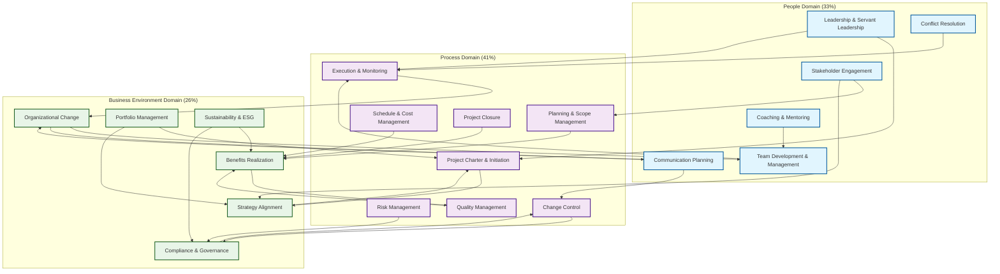
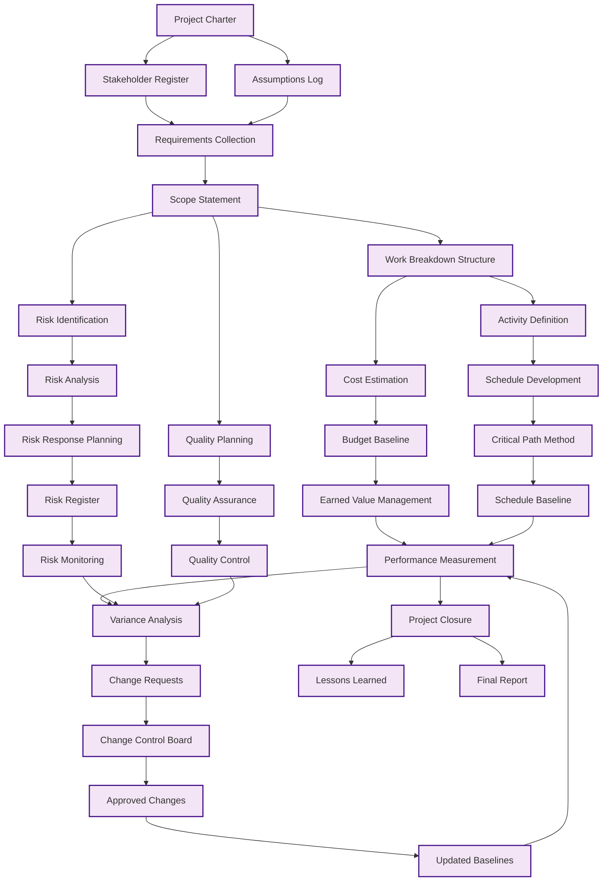
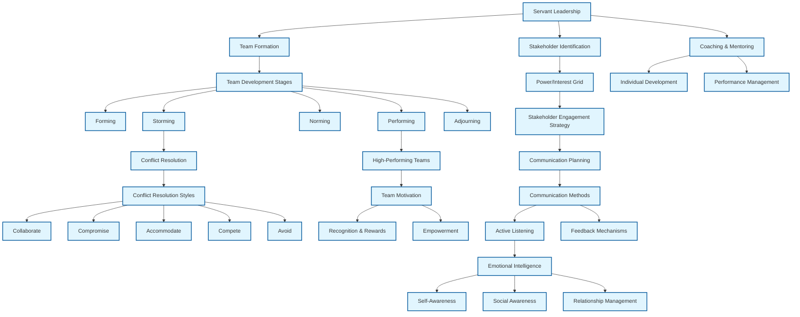
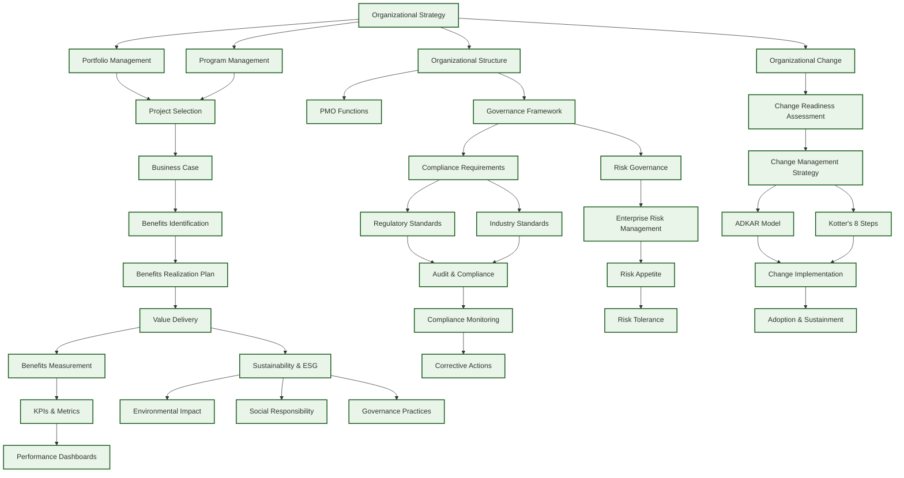
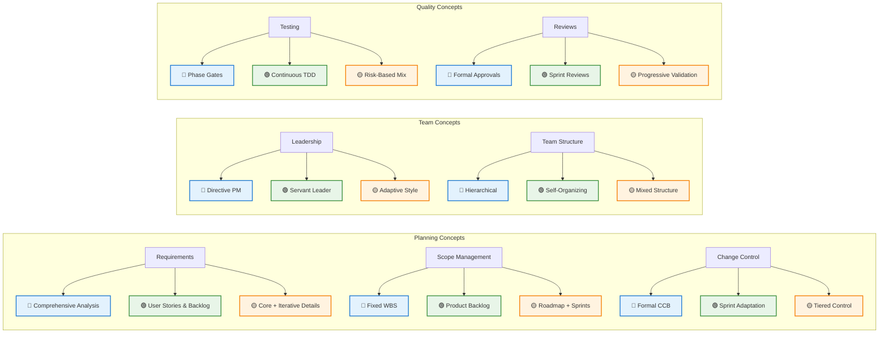

# PMP Concept Map

## Overview

This concept map shows how major project management concepts relate to each other across the three exam domains. Use this visual guide to understand the interconnected nature of project management knowledge and see how concepts from different domains work together in practice.

The PMP exam is structured around three domains with specific weightings:
- **People Domain (33%)**: Leadership, team management, stakeholder engagement
- **Process Domain (41%)**: Planning, execution, monitoring, control, closure
- **Business Environment Domain (26%)**: Strategy, compliance, organizational change

> Note: Chapter-reference links in this concept map are being updated to match this repository’s chapter structure. For v1, broken chapter links have been removed; references remain as text.

## High-Level Domain Relationships

The following diagram illustrates the major concepts within each domain and shows how they connect across domain boundaries:

### Key Cross-Domain Relationships

**Leadership → Process Integration**:
- Leadership drives project initiation and charter development
- Servant leadership principles guide execution and team coordination
- Leadership decisions impact change control and project closure

**Stakeholder Engagement → Strategy Alignment**:
- Stakeholder needs inform strategic project selection
- Engagement strategies must align with organizational objectives
- Stakeholder feedback drives benefits realization planning

**Communication → Change Management**:
- Effective communication is essential for organizational change
- Communication planning supports change control processes
- Transparent communication builds trust during transformations

**Risk Management → Compliance**:
- Risk identification includes regulatory and compliance risks
- Risk response strategies must consider governance requirements
- Risk monitoring supports ongoing compliance assurance

**Quality → Benefits Realization**:
- Quality standards directly impact delivered benefits
- Quality planning aligns with expected business outcomes
- Quality assurance validates benefit achievement

## Detailed Domain Concept Maps

### Process Domain (41%) - Detailed View

The Process domain encompasses the technical aspects of project management, from initiation through closure:

### People Domain (33%) - Detailed View

The People domain focuses on leadership, team dynamics, and stakeholder management:

### Business Environment Domain (26%) - Detailed View

The Business Environment domain addresses organizational context and strategic alignment:

## Concept-to-Chapter Mapping

This section provides direct links from each concept in the diagrams above to the relevant chapters where they are discussed in detail.

### People Domain Concepts

| Concept | Primary Chapter | Additional References |
|---------|----------------|----------------------|
| **Leadership & Servant Leadership** | Chapter 03.2: Coaching, Mentoring, and Servant Leadership | Chapter 03.1: Building and Leading Teams, Chapter 03.2: Servant Leadership in Practice |
| **Team Development & Management** | Chapter 03.1: Building and Leading Teams | Chapter 03.1: Team Composition and Development |
| **Stakeholder Engagement** | Chapter 04.1: Stakeholder and Communication Mastery | Chapter 01.4a: Stakeholders and Communication, Chapter 04.1: Stakeholder Identification and Analysis |
| **Communication Planning** | Chapter 04.1: Communication Planning and Strategy | Chapter 04.1: Adapting Communication and Cultural Considerations |
| **Conflict Resolution** | Chapter 04.2: Conflict, Negotiation, and Decision-Making | Chapter 03.1: Conflict Resolution and Problem-Solving, Chapter 04.2: Conflict Resolution Styles and Approaches |
| **Coaching & Mentoring** | Chapter 03.2: Coaching and Developing Others | Chapter 03.2: Mentoring and Continuous Learning |
| **Emotional Intelligence** | Chapter 03.1: Building and Leading Teams | Chapter 03.2: Coaching, Mentoring, and Servant Leadership |

### Process Domain Concepts

| Concept | Primary Chapter | Additional References |
|---------|----------------|----------------------|
| **Project Charter & Initiation** | Chapter 10: Initiating and Planning | Chapter 05.1c: Developing the Project Charter |
| **Planning & Scope Management** | Chapter 06.1: Planning for Value Delivery | Chapter 06.1: Scope Definition and Baseline |
| **Schedule & Cost Management** | Chapter 06.1: Schedule Planning and Work Breakdown | Chapter 06.1: Cost Estimation and Budgeting, Chapter 09.1: Schedule and Cost Control |
| **Risk Management** | Chapter 07.1: Risk, Issues, and Change Management | Chapter 01.4d: Risk Management, Chapter 07.1a: Understanding Risk |
| **Quality Management** | Chapter 06.1: Quality Planning and Acceptance Criteria | Chapter 01.4c: Quality, Chapter 08.1: Quality Assurance and Testing |
| **Execution & Monitoring** | Chapter 08.1: Executing and Delivering Work | Chapter 09.1: Monitoring, Controlling, and Closing |
| **Change Control** | Chapter 07.1e: Change Management | Chapter 09.1: Change Control and Configuration Management |
| **Project Closure** | Chapter 09.1: Project Closure and Transition | Appendix A.4: The Closing Process Group |
| **Earned Value Management** | Chapter 09.1: Tracking Progress and Performance | Chapter 09.1: Schedule and Cost Control |

### Business Environment Domain Concepts

| Concept | Primary Chapter | Additional References |
|---------|----------------|----------------------|
| **Strategy Alignment** | Chapter 02.1: Strategy and Portfolio Alignment | Chapter 02.1a: Organizational Strategy and Project Selection |
| **Benefits Realization** | Chapter 02.2: Benefits, Value, and Sustainability | Chapter 02.1d: Benefits Realization and Value Creation, Chapter 02.2: Benefits Realization Planning and Identification |
| **Compliance & Governance** | Chapter 02.3: Compliance, Risk, and Governance | Chapter 02.3: Enterprise Risk and Governance Frameworks |
| **Organizational Change** | Chapter 02.4: Organizational Change and Readiness | Chapter 02.4: Change Management Strategies and Frameworks |
| **Portfolio Management** | Chapter 02.1b: Portfolio Management Concepts | Chapter 02.5: Program Management |
| **Sustainability & ESG** | Chapter 02.2: Sustainability and ESG in Project Context | Chapter 02.2: Benefits, Value, and Sustainability |
| **PMO Functions** | Chapter 02.1h: Project Management Offices | Chapter 02.1: Strategy and Portfolio Alignment |
| **Regulatory Standards** | Chapter 02.3: Regulatory and Legal Compliance | Chapter 02.3: Data Privacy and Information Security |

### Cross-Domain Integration Points

| Integration Area | Chapters | Key Concepts |
|------------------|----------|--------------|
| **Leadership in Process Management** | Chapter 03.1, Chapter 10, Chapter 08.1 | How servant leadership principles guide project initiation, planning, and execution |
| **Stakeholder-Driven Strategy** | Chapter 04.1, Chapter 02.1 | Stakeholder influence on strategic project selection and portfolio decisions |
| **Communication for Change** | Chapter 04.1, Chapter 02.4 | Communication strategies that support organizational transformation |
| **Risk and Compliance Integration** | Chapter 07.1, Chapter 02.3 | How project risk management aligns with enterprise governance |
| **Quality and Value Delivery** | Chapter 06.1, Chapter 02.2 | Quality standards that ensure benefits realization |
## Delivery Approach Context Annotations

Different project management concepts apply differently depending on the delivery approach being used. This section shows how key concepts vary across predictive (waterfall), agile, and hybrid approaches.

### Legend
- 🔵 **Predictive**: Traditional waterfall approach with sequential phases
- 🟢 **Agile**: Iterative and incremental approach with frequent delivery
- 🟡 **Hybrid**: Combination of predictive and agile approaches
- ⚪ **Universal**: Applies to all delivery approaches

### Context-Specific Concept Applications

#### Planning and Scope Management
| Concept | Predictive 🔵 | Agile 🟢 | Hybrid 🟡 | Notes |
|---------|---------------|----------|-----------|-------|
| **Requirements Collection** | Comprehensive upfront analysis | Continuous refinement through user stories | Mix of upfront and iterative | Chapter 06.1 |
| **Scope Definition** | Detailed WBS with fixed scope | Product backlog with evolving scope | Core scope fixed, details iterative | Chapter 06.1 |
| **Schedule Planning** | Gantt charts, critical path | Sprint planning, velocity tracking | Roadmaps with sprint details | Chapter 06.1 |
| **Change Control** | Formal change control board | Continuous adaptation within sprints | Formal for core, flexible for details | Chapter 07.1e |

#### Team Management and Leadership
| Concept | Predictive 🔵 | Agile 🟢 | Hybrid 🟡 | Notes |
|---------|---------------|----------|-----------|-------|
| **Team Structure** | Hierarchical with defined roles | Self-organizing cross-functional teams | Mix of hierarchy and self-organization | Chapter 03.1 |
| **Leadership Style** | Directive project management | Servant leadership and coaching | Adaptive leadership based on context | Chapter 03.2 |
| **Decision Making** | PM-driven with stakeholder input | Team-driven with PM facilitation | Context-dependent decision authority | Chapter 04.2 |
| **Communication** | Formal reports and meetings | Daily standups and retrospectives | Mix of formal and informal channels | Chapter 04.1 |

#### Risk and Quality Management
| Concept | Predictive 🔵 | Agile 🟢 | Hybrid 🟡 | Notes |
|---------|---------------|----------|-----------|-------|
| **Risk Planning** | Comprehensive risk register upfront | Continuous risk identification | Core risks planned, others emergent | Chapter 07.1b |
| **Quality Assurance** | Phase gates and formal reviews | Definition of done and continuous testing | Mix of gates and continuous practices | Chapter 08.1 |
| **Testing Strategy** | End-phase testing cycles | Test-driven development | Risk-based testing approach | Chapter 06.1 |

#### Stakeholder Engagement
| Concept | Predictive 🔵 | Agile 🟢 | Hybrid 🟡 | Notes |
|---------|---------------|----------|-----------|-------|
| **Stakeholder Involvement** | Defined touchpoints and reviews | Continuous collaboration | High involvement in core, periodic in details | Chapter 04.1 |
| **Feedback Cycles** | Formal review and approval gates | Sprint reviews and retrospectives | Mix of formal and frequent feedback | Chapter 04.1 |
| **Requirements Validation** | Sign-off at phase completion | Acceptance criteria and demos | Progressive validation approach | Chapter 06.1 |

### Delivery Approach Selection Guidance

#### When to Use Predictive 🔵
- **Regulatory environments** with strict compliance requirements
- **Well-understood requirements** that are unlikely to change
- **Fixed scope and budget** constraints
- **Sequential dependencies** that require waterfall execution
- **Risk-averse organizations** preferring detailed upfront planning

*Example*: Office renovation project with building codes and fixed timeline

#### When to Use Agile 🟢
- **Uncertain or evolving requirements** that benefit from experimentation
- **Innovation projects** where learning and adaptation are key
- **Customer-facing products** requiring frequent feedback
- **Cross-functional teams** capable of self-organization
- **Organizations embracing change** and continuous improvement

*Example*: Software development with evolving user needs

#### When to Use Hybrid 🟡
- **Large, complex projects** with both stable and uncertain elements
- **Organizational constraints** requiring some traditional practices
- **Mixed stakeholder preferences** for different approaches
- **Phased delivery** where some phases suit predictive, others agile
- **Transition periods** moving from predictive to agile

*Example*: Digital transformation with infrastructure (predictive) and application development (agile)

### Context-Aware Concept Map

The following diagram shows how the same concepts apply differently across delivery approaches:

## How to Use This Concept Map

### For Study Planning
1. **Start with the high-level domain diagram** to understand overall relationships
2. **Dive into detailed domain maps** for areas where you need deeper understanding
3. **Use the chapter mapping table** to find specific content for each concept
4. **Review delivery approach contexts** to understand how concepts vary by methodology

### For Exam Preparation
1. **Focus on cross-domain connections** - these are frequently tested
2. **Understand context variations** - exam questions often specify delivery approach
3. **Use concept relationships** to eliminate wrong answers
4. **Practice with scenarios** that span multiple domains

### For Practical Application
1. **Map your project context** to the appropriate delivery approach
2. **Identify relevant concepts** for your specific situation
3. **Follow concept dependencies** to ensure proper sequencing
4. **Adapt concepts** based on your organizational context

---

*This concept map is designed to complement the detailed chapter content. Use it as a navigation aid and relationship guide, but always refer to the specific chapters for comprehensive understanding of each concept.*